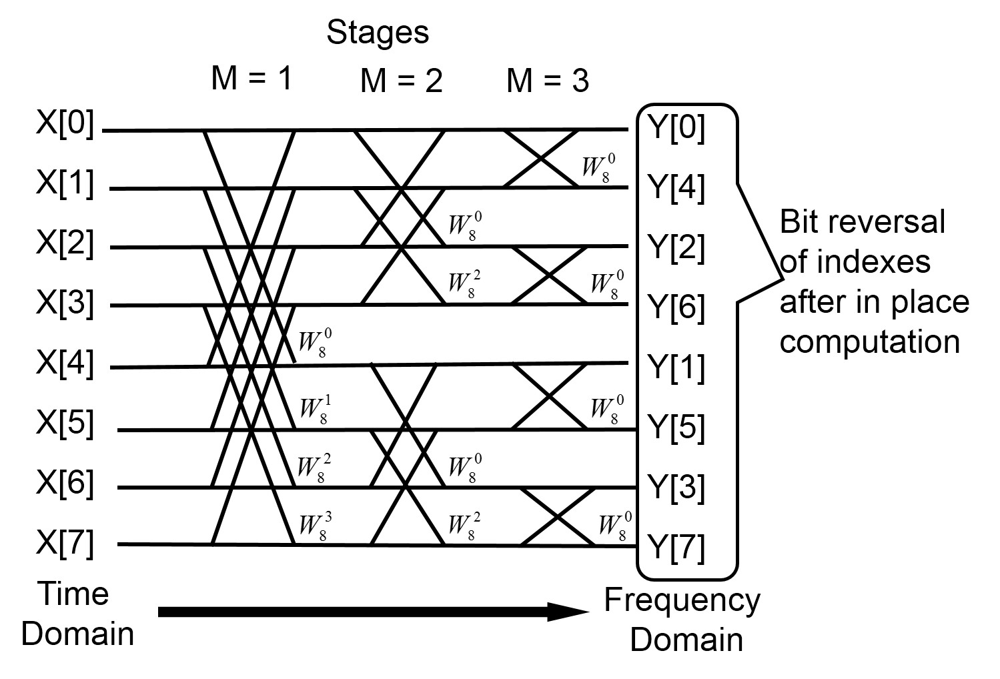

# 18624 Final Project

This is my final project for 18624: Open Source Chip Design! 
Personal Repository: https://github.com/singrongchiu/TinyTuner 

*If you want to directly flash onto the FPGA, you can use next-pnr with src/constraints.lpf, or the above repo contains a bitstream.bit file*

## TinyTuner
A small device that can tell you the dominant frequency sound group. 

The system takes audio input from a digital PDM microphone. Since this type of microphone produces a high-speed stream of single bits, the system first processes this stream to convert it into a more standard digital audio format (PCM) at a lower data rate. This processed audio data is then sent to a module that performs a Fast Fourier Transform (FFT). The FFT's job is to analyze the audio and figure out which frequencies are present and how strong they are. After the FFT, the system looks at the results to find the single frequency band that had the strongest signal. Finally, it takes the numerical index of this strongest frequency band and displays that number on a seven-segment display, providing a visual indication of the dominant frequency detected in the audio input.  

Here is a video of the module flashed onto an FPGA: 
https://youtu.be/xEocxD9gWbU 

## IO

An IO table listing all of your inputs and outputs and their function, like the one below:

| Input/Output | Description|																
|-------------|--------------------------------------------------|
| io_in[0]    | pdm microphone data input                        |
| io_in[11:1] | unused                                           |
| io_out[6:0] | seven segment output                             |
| io_out[7]   | pdm microphone clk output (needed to drive mic)  |

## How to Test

A short description of how to test the design post-tapeout:  
The sampling frequency is 5000 Hz, and so to test each bin, we can use frequencies:  

BIN 0 : 0 - 625 Hz   
BIN 1 : 625 - 1250 Hz  
BIN 2 : 1250 - 1875 Hz  
BIN 3 : 1875 - 2500 Hz  
BIN 4 : 2500 - 3125 Hz  
BIN 5 : 3125 - 3750 Hz  
BIN 6 : 3750 - 4375 Hz  
BIN 7 : 4375 - 5000 Hz  

Play the sine wave frequency next to the microphone, and see the bin change!  

However, since the sampling frequency is relatively low, and there are only 8 bins in this FFT, there is a lot of aliasing that happens and at times it can flicker between bins. 

## Design Choices
### Hardware
I chose to use a PDM microphone, which allows for audio to be processed digitally. I also decided to output the dominant FFT bin on a 7segment display.  

### FFT Implementation
I decided to implement the version of Radix-2 FFT that does bit reversing at the end, instead of having to change the indices of my mic inputs at the start; this allows for easier implementation and faster logic. The FFT is done iteratively through log2(N) stages and butterfly operations that occur at every stage. I also decided to roll out all the stages so that Yosys could tell that I am not accessing the same indices of an array with different generations of pairs and groups (within the butterfly stage). Note that a general design FFT that is able to generate the stages based on the number of samples/bins N is available at https://github.com/singrongchiu/TinyTuner/blob/main/fftcode/fftstagepipeline.sv.  

Twiddle Factors (roots of unity), or the weights that are multiplied at each butterfly operation were generated using the file twiddlegenerate.py from my personal repository. 

### Pipelining
I decided to pipeline the FFT by stage, since I don't need to know the dominant frequency faster than my human eye can see the difference on the screen of a tuner. This would also allow us to not have to worry about delay as much or timing the number of clock cycles through the entire system. However, this implementation is a lot slower than pipelineing by sample input like in https://www.sciencedirect.com/science/article/pii/S2213138821008729. Our PDM microphone takes in many digital mic input cycles within one fft stage cycle, resulting in a more accurate audio sample. However, the downside is that there is more hardware associated with every stage.   

### Number of Samples
I was only able to fit an N = 8 point FFT on my FPGA board due to limited hardware resources. When we have 8 points for an FFT, we divide the sampling frequency into 8 bins. While I originally intended for the device to be able to output Note values, this design wouldn't allow us to tell the exact note because in lower frequencies, notes can be differentiated by tens of Hz.   

## Testing
N = 64 point FFT working shown in the following testbench: 
https://www.edaplayground.com/x/M8Zf
Note that the SV implementation above is generalizable to N=2^x points (with the caveat that the twiddle factors need to be regenerated for different N). 

N = 8 point FFT working shown in the following testbench (stages are rolled out):
https://edaplayground.com/x/B7y7

The output is verifiable by comparing it to an online FFT calculator like this one (https://scistatcalc.blogspot.com/2013/12/fft-calculator.html). Input the stage_real0 printed into the real values list, and the outputs should match. Note that the output indices from the EDAPlayground FFT are not bit reversed.  

This is an example of how to reverse index bits in the output for N = 8.    
output 000 -> bin 000    
output 001 -> bin 100    
output 010 -> bin 010    
output 011 -> bin 110    
output 100 -> bin 001    
output 101 -> bin 101    
output 110 -> bin 011    
output 111 -> bin 111    

## Modules
###  pdm to pcm
The PDM-to-PCM conversion module handles the interface with the PDM microphone. It accumulates incoming 1-bit PDM data over a window of 500 clock cycles to compute a single 8-bit PCM value. During accumulation, it also toggles a microphone clock (mic_clk) at half the PLL clock rate to maintain compatibility with typical PDM microphones. Once 500 samples are collected, the module outputs a valid PCM sample (pcm_data) and asserts a pcm_valid signal. It also generates a slower strobe signal, fft_clk_en, to pace the FFT pipeline such that it receives one sample per 500 PDM clock cycles. 

### Radix2FFTPipeline8N  
The Radix2FFTPipeline8N module implements a pipelined Fast Fourier Transform (FFT) using a Radix-2 algorithm for a fixed size 8. It is designed to process complex input data, although in this specific instantiation, the imaginary input (in_imag) is hardwired to zero. The module takes a clock (clk), a reset (reset), the real and imaginary parts of the input data (in_real, in_imag), and an input valid signal (in_valid). It outputs a out_valid signal when the FFT result is ready, the index of the frequency bin with the highest magnitude (highest_bin), and the maximum magnitude found (out_max_magnitude). The FFT is implemented across multiple pipeline stages (determined by the logarithm base 2 of N). Each stage performs butterfly operations and applies twiddle factors. The module utilizes internal buffers (stage_real, stage_imag) to hold the data between stages. It includes pre-calculated twiddle factors stored in local parameters. The magnitude calculation at the output stage is a simplified pseudo-magnitude (sum of absolute values of real and imaginary parts) due to resource constraints on the target FPGA. I also implemented a shift multiply function to get around the lack of enough multipliers on the FPGA. The input data is also buffered before entering the pipeline.  

###  bit reverse  
The bit_reverse module is a simple combinational circuit designed to reverse the bit order of a fixed-width input data bus. It takes a data_in of width BIN_WIDTH (parameterized to 3) and outputs data_out with the bits in reverse order. The implementation uses a case statement to handle different possible widths, although only a width of 3 is explicitly handled in the provided code. This module is used to perform the necessary bit-reversal on the output indices of the FFT to get the frequency bins in sequential order.  
  
## Acknowledgements
Butterfly operations based on:
https://arishalreja.github.io/projects/fftprocessor/

